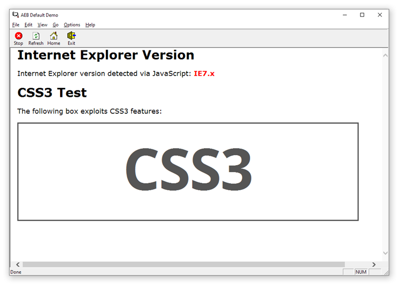
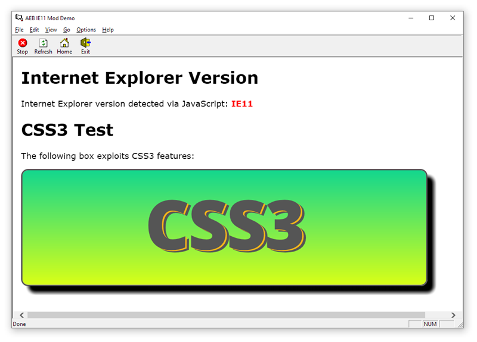
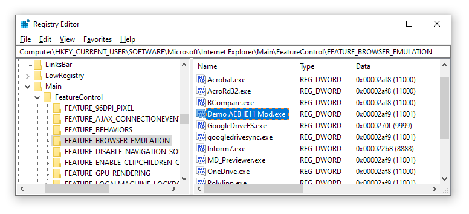

# Demo E-Books

This folder contains the demo Activ E-Books for **AEB IE11 Mod**.

- [`/html/`][html/] — E-Book source files:
    + `aeb-ie11-mod.exe` — The **AEB IE11 Mod** application.
    + [`index.html`][index.html] — E-Books Home page.
    + [`styles.css`][styles.css] — E-Books CSS3 stylesheet.
- `Demo AEB IE11 Mod.aep` — E-Book project using the IE11 Mod.
- `Demo Default.aep` — E-Book project without the IE11 Mod, for comparison.
- [`delete-registry-key.bat`][delete-registry-key.bat] — deleted the IE11 emulation registry key.
- [`show-registry-entries.bat`][show-registry-entries.bat] — open Registry Editor at `FEATURE_BROWSER_EMULATION`.
- [`splash-default.bmp`][splash-default.bmp] — splash image for default mode demo E-Book.
- [`splash-ie11-mod.bmp`][splash-ie11-mod.bmp] — splash image for IE11 demo E-Book.


-----

**Table of Contents**

<!-- MarkdownTOC autolink="true" bracket="round" autoanchor="false" lowercase="only_ascii" uri_encoding="true" levels="1,2,3" -->

- [E-Book Projects](#e-book-projects)
    - [The Default Demo E-Book](#the-default-demo-e-book)
    - [The AEB IE11 Mod Demo E-Book](#the-aeb-ie11-mod-demo-e-book)
        - [Batch Helpers](#batch-helpers)
- [AEB Projects Warning](#aeb-projects-warning)

<!-- /MarkdownTOC -->

-----

# E-Book Projects

There are two demo E-Books, one (`Demo AEB IE11 Mod.exe`) showing the **AEB IE11 Mod** in action, the other (`Demo Default.exe`) showing the default behavior of Activ E-Book (i.e. without the IE11 mod), so that the same HTML/CSS3 contents can be compared with and without the IE11 emulation mod.

Neither E-Book is included in the repository in compiled form (i.e. their `.exe` files are not tracked by Git), only their [Activ E-Book Compiler] projects are (i.e. their `.aep` files). To obtain the compiled E-Books, download the latest precompiled binary distribution from the repository [_Releases_ page], or compile them yourself ([see warning note](#aeb-projects-warning)).

Both E-Books share the same contents source folder:

- [`/html/`][html/]
    + `aeb-ie11-mod.exe` (_after compiling_)
    + [`index.html`][index.html]
    + [`styles.css`][styles.css]

The `aeb-ie11-mod.exe` file is not included in the repository (i.e. not tracked by Git) and needs to be generated by compiling the [PureBasic] source project in the [`../src/`][src/] folder.


## The Default Demo E-Book

The default demo E-Book project and its assets, showing the default-behavior of Activ E-Books (i.e. without using **AEB IE11 Mod**):

- `Demo Default.aep`
- `Demo Default.exe` (_after compiling_)
- [`splash-default.bmp`][splash-default.bmp]

Here's a screenshot of the `Demo Default.exe` E-Book:



As you can see from the screenshot, CSS3 styles and effects are being ignored, and the JavaScript snippet is detecting the browser as Internet Explorer version 7.


## The AEB IE11 Mod Demo E-Book

The **AEB IE11 Mod** demo E-Book project and its assets:

- `Demo AEB IE11 Mod.aep`
- `Demo AEB IE11 Mod.exe` (_after compiling_)
- [`splash-ie11-mod.bmp`][splash-ie11-mod.bmp]

Here's a screenshot of the `Demo AEB IE11 Mod.exe` E-Book:



As you can see from the screenshot, CSS3 styles and effects are being shown properly, even though it's the same HTML page and stylesheet used in the `Demo Default.exe` E-Book, and the JavaScript snippet is now detecting the browser as Internet Explorer version 11.


### Batch Helpers

I've also included two batch script helpers for this E-Book:

- [`delete-registry-key.bat`][delete-registry-key.bat] — deletes the IE11 emulation registry key for this E-Book.
- [`show-registry-entries.bat`][show-registry-entries.bat] — open Registry Editor at `FEATURE_BROWSER_EMULATION`.

-------------------------------------------------------------------------------

The first script ([`delete-registry-key.bat`][delete-registry-key.bat]) allows you to quickly delete the `FEATURE_BROWSER_EMULATION` Registry key created by the AEB IE11 Mod demo E-Book to enable IE11 emulation for itself — only the Registry entry for `Demo AEB IE11 Mod.exe` will be affected, and nothing else. This allows you to experience again, first hand, how the E-Book using **AEB IE11 Mod** behaves the first time it's opened by an end user.

If you want to reuses this script for you own E-Book projects, you'll just need to edit its last line, by replacing `Demo AEB IE11 Mod.exe` with the filename of your compiled E-Book:

```
REG DELETE "HKEY_CURRENT_USER\SOFTWARE\Microsoft\Internet Explorer\Main\FeatureControl\FEATURE_BROWSER_EMULATION" /v "Demo AEB IE11 Mod.exe"
```

(don't forget to enclose the E-Book filename between double-quotes, as in the script)

The `FEATURE_BROWSER_EMULATION` key works on a _per filename_ basis (just the filename, without the full path).

-------------------------------------------------------------------------------

The other script ([`show-registry-entries.bat`][show-registry-entries.bat]) opens the Windows Registry Editor (**regedit**) at `FEATURE_BROWSER_EMULATION`:



It's just a convenience helper to save you time navigating through the Registry. You might want to use it just once, since the Registry Editor allows you to add key-paths to your Favorites list (via the **Favorites** &gt; **Add to Favorites…** menu).

> **WARNING** — Just _be careful_ when dealing with the Registry. Randomly deleting keys, or editing their values, might result in system instability, unexpected behaviors, and even render Windows unusable. Avoid experimenting, unless you know what you're doing.


# AEB Projects Warning

Since these Activ E-Book projects where created on my PC, they contain absolute path to my machine which won't match your local repository path. In order to compile the E-Books on your machine, you'll need to manually update the projects by re-scanning the source folder using your local absolute path to the [`/html/`][html/] directory, and fix other similar issues relating to E-Book assets path differences (splash screen, icon, etc.).

<!-----------------------------------------------------------------------------
                               REFERENCE LINKS
------------------------------------------------------------------------------>

[_Releases_ page]: https://github.com/tajmone/aeb-ie11-mod/releases/latest/ "Go to the Releases page of the AEB IE11 Mod repository"

<!-- apps -->

[PureBasic]: https://www.purebasic.com "Visit PureBasic website"
[Activ E-Book Compiler]: http://www.ebookcompiler.com  "Visit Activ E-Book Compiler website"

<!-- files and folders -->

[src/]: ../src/

[html/]: ./html/ "Navigate to demo E-Books contents folder"
[index.html]: ./html/index.html "View demo E-Books HTML page source"
[styles.css]: ./html/styles.css "View demo E-Books CSS3 stylesheet"

[delete-registry-key.bat]: ./delete-registry-key.bat "View batch script to delete IE11 browser emulation key of Demo E-Book from the Registry"
[show-registry-entries.bat]: ./show-registry-entries.bat "View batch script to open Registry Editor at FEATURE_BROWSER_EMULATION"
[splash-default.bmp]: ./splash-default.bmp "View splash image for 'Demo AEB IE11 Mod' E-Book"
[splash-ie11-mod.bmp]: ./splash-ie11-mod.bmp "View splash image for 'Demo Default' E-Book"

<!-- EOF -->
